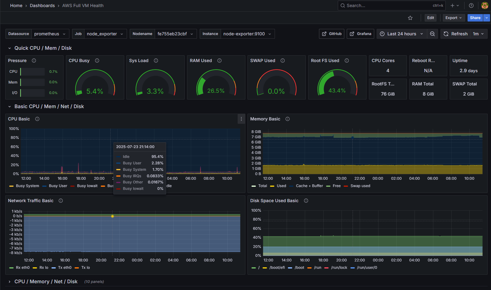
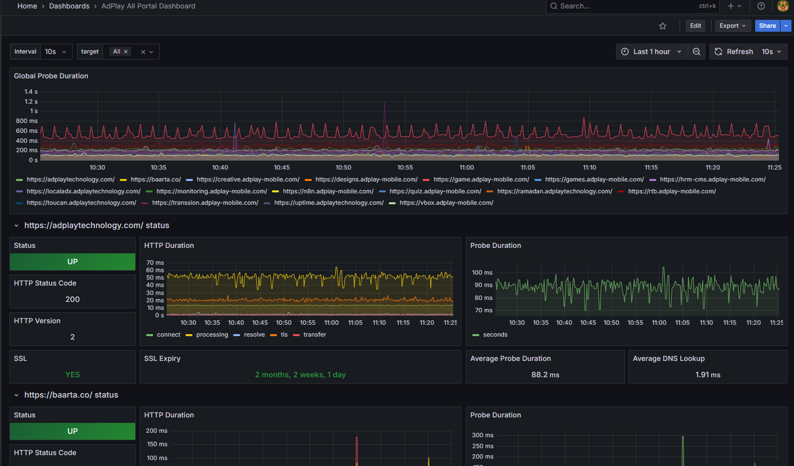
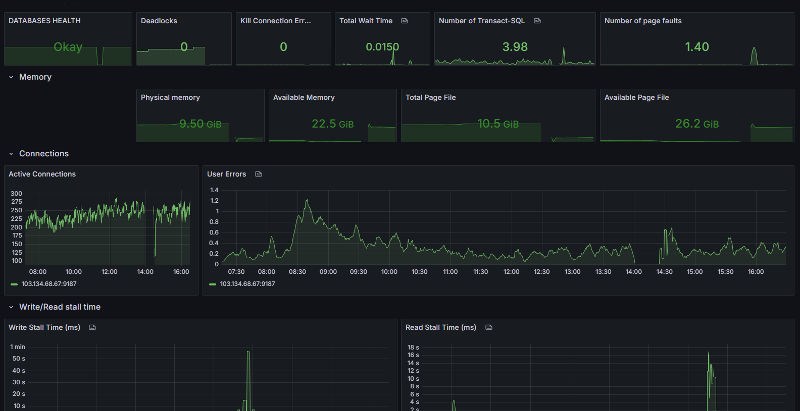

## Dashboard Previews

Here are some examples of the dashboards included in this monitoring stack.

### Server Health Dashboard (Linux & Windows)


### Website Status Dashboard (Blackbox)


### MS SQL Server Dashboard


# Full-Stack Monitoring with Prometheus & Grafana

This repository contains the complete configuration for a robust monitoring stack using Docker, Prometheus, and Grafana. It is designed to provide comprehensive health and performance monitoring for servers and websites across different cloud environments and operating systems.

The entire stack runs in Docker containers orchestrated by Docker Compose, making it portable and easy to manage.

## What's Being Monitored

This configuration is pre-built to monitor:
* **Host System Metrics (DigitalOcean VM):** Full health monitoring of the main server running the stack (CPU, Memory, Disk I/O, Network).
* **Remote Linux System Metrics (AWS VM):** Full health monitoring of a remote AWS EC2 instance.
* **Remote Windows System Metrics (Azure Stack Hub VM):** Health monitoring of a Windows Server VM, including CPU, Memory, and Disk Usage.
* **Database Metrics (MS SQL Server 2022):** Performance and health metrics for a Microsoft SQL Server instance.
* **Website & URL Health:** Uptime, response time, and SSL certificate health for **22 web endpoints**, separated into logical groups.

## Folder Structure

The configuration is split into multiple files for easier management.

```
.
├── docker-compose.yml      # Main file to launch all services.
├── alertmanager_config/
│   └── config.yml          # Create Alert Rule
├── prometheus_config/
│   ├── prometheus.yml  
│   ├── alert.rules.yml    # Main prometheus config, loads job files.
│   └── scrape_configs/
│       ├── websites.yml    # All website monitoring jobs.
│       ├── nodes.yml       # All Linux/Windows server monitoring jobs.
│       └── sql.yml 
├── loki_config/           
│   └── loki-config.yml
├── promtail_config/       
│   └── promtail-config.yml        # The SQL server monitoring job.
├── nginx_config/
│   └── default.conf        # NGINX config: reverse proxy for Grafana.
├── blackbox_config/
│   └── config.yml          # Blackbox Exporter config: how to probe URLs.
└── README.md               # This documentation file.
```

## Prerequisites

Before you begin, you will need:
1.  **A primary server** (e.g., a DigitalOcean VM) where the monitoring stack will run.
2.  **Docker and Docker Compose** installed on this primary server.
3.  **A domain name** (e.g., `adplay-mobile.com`).
4.  **A Cloudflare account** managing your domain's DNS.
5.  **One or more remote servers to monitor** (e.g., an AWS EC2 instance and a Windows VM).

## Installation & Setup Guide

### Step 1: Set Up Remote Servers to be Monitored

#### On each Linux Server (e.g., AWS EC2):
1.  Install Docker.
2.  Run the Node Exporter container:
    ```bash
    sudo docker run -d --name=node-exporter --net="host" --pid="host" -v "/:/host:ro,rslave" quay.io/prometheus/node-exporter:latest --path.rootfs=/host
    ```
3.  In your cloud firewall (e.g., AWS Security Group), open **TCP port 9100** and allow access from your DigitalOcean monitoring server's IP.

#### On the Windows SQL Server:
1.  Follow the detailed manual setup instructions to install `windows_exporter` (on port 9182) and `sql_exporter` (on port 9187). This includes creating a low-privilege user and setting up the services.
2.  In your cloud firewall (e.g., Azure Stack Hub NSG), open **TCP ports 9182 and 9187** and allow access from your DigitalOcean monitoring server's IP.
3.  In the Windows Defender Firewall on the VM, also add inbound rules to allow traffic on TCP ports 9182 and 9187.

### Step 2: Configure the Main Monitoring Server (DigitalOcean)

1.  Clone this repository to your DigitalOcean server.
2.  **Configure DNS**: In Cloudflare, create an **A record** for a subdomain (e.g., `monitoring`) that points to your DigitalOcean server's public IP. Ensure the proxy status is **Enabled** (orange cloud).
3.  **Configure NGINX**: Edit `nginx_config/default.conf` and replace `monitoring.adplay-mobile.com` with your chosen subdomain.
4.  **Configure Prometheus**:
    * Edit `prometheus_config/scrape_configs/nodes.yml` and add the public IPs of your AWS and Windows VMs.
    * Edit `prometheus_config/scrape_configs/websites.yml` to add or remove any URLs you wish to monitor.

### Step 3: Launch the Stacks

1.  **Launch the main monitoring stack**:
    ```bash
    cd /path/to/your/cloned/repo
    sudo docker-compose up -d
    ```
2.  **Launch the local Node Exporter**: This command runs the Node Exporter for the DigitalOcean VM itself and connects it to the Docker network.
    ```bash
    # (Ensure any old node-exporter is removed: sudo docker rm -f node-exporter)
    sudo docker run -d \
      --name=node-exporter \
      --network=monitoring-stack_monitoring_net \
      -v "/proc:/host/proc:ro" \
      -v "/sys:/host/sys:ro" \
      -v "/:/rootfs:ro" \
      quay.io/prometheus/node-exporter:latest \
      --path.procfs=/host/proc \
      --path.sysfs=/host/sys \
      --path.rootfs=/rootfs
    ```
    *(Note: The network name is based on the directory name. Use `docker network ls` to confirm.)*

### Step 4: Configure Grafana

1.  Navigate to your domain (e.g., `https://monitoring.adplay-mobile.com`).
2.  Log in to Grafana (`admin`/your password).
3.  **Add Prometheus as a Data Source**:
    * Go to **Administration -> Data sources -> Add data source**.
    * Select Prometheus.
    * Set the **Prometheus server URL** to `http://prometheus:YOUR_PORT`.
    * Click "Save & Test".
4.  **Import Dashboards**:
    * Go to **Dashboards -> New -> Import**.
    * Import the following dashboards by their ID. Remember to change the **Name** and **UID** for each import to create separate, dedicated dashboards.
        * **`7587`**: For website health (Blackbox). Import this multiple times, once for each job (`blackbox`, `blackbox_portals`, etc.).
        * **`1860`**: For Linux server health (Node Exporter).
        * **`14694`** or **`10467`**: For Windows Server health.
        * **`14333`** or **`19420`**: For MS SQL Server health.

## Accessing Services
* **Grafana Dashboard**: `https://<your_subdomain>`
* **Prometheus UI**: `http://<Your_DO_Server_IP>:YOUR_PORT` (Requires opening port 9090 in your DigitalOcean firewall).

## Dashboard Previews

Here are some examples of the dashboards included in this monitoring stack.

### Server Health Dashboard (Linux & Windows)


### Website Status Dashboard (Blackbox)


### MS SQL Server Dashboard
